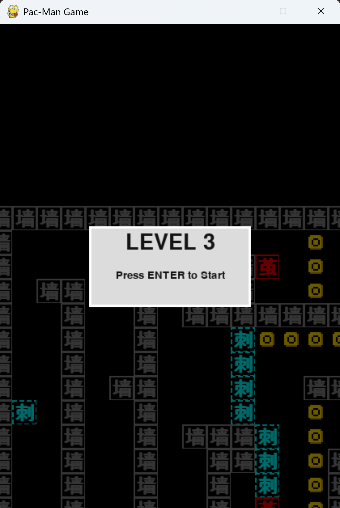
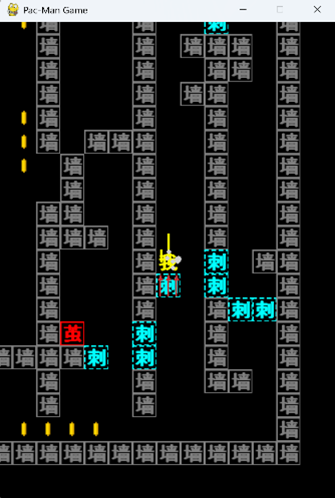
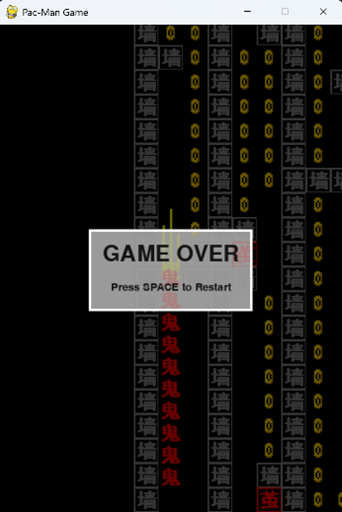

# Pac-Human Game

## 1. 游戏功能设计 (Game Design)

### 1.1 界面设计 (Interface Design)

**关卡启动界面**
> 界面显示以玩家出生点为中心的静态地图背景，中间提示关卡编号以及按“Enter”键开始游戏。
> * 每个关卡编号顺序进行。
> * 通过一个关卡后自动进入下一关。



**游戏进行界面**
> 进入关卡后的游玩界面。
> * 玩家始终在界面中心，地图在玩家移动时相应移动。
> * 界面中显示游戏中可视的 sprites 对象。



**死亡界面**
> 以死亡时的静态图为背景，中间部分显示游戏结束和按“space”键重玩。
> * 按下“space”后会重启这一关卡。



---

### 1.2 游戏交互元素 (Interactive Elements)

| 元素 | 图标 | 描述 |
| :--- | :---: | :--- |
| **玩家 (Player)** |  | **“我”**：作为玩家角色，通过 `WSAD` / `上下左右` 键分别控制角色的移动。|
| **敌对生物 - 茧** |  | **“茧”**：属于静态触发器，且为碰撞单位。当玩家进入以其为中心 3*3 范围时开始计时，一段时间后茧消失，变成“鬼”。[cite: 19] |
| **敌对生物 - 鬼** |  | [cite_start]**“鬼”**：会追击玩家，玩家接触到“鬼”后立即死亡。|
| **陷阱 - 刺** |  | [cite_start]**“刺”**：属于动态触发器，且为碰撞单位。以其为中心的上下左右各一格为攻击范围，玩家进入范围后，会自动旋转到玩家位置开始计时，随后伸出刺，触碰后死亡。|
| **环境 - 墙** |  | [cite_start]**“墙”**：作为碰撞单位，划定地图范围，玩家移动空间。|
| **环境 - 硬币** |  | [cite_start]**“硬币”**：可以拾取，玩家碰到后会消失。（没有记录信息，有强迫症的话可以把它们都捡起来）|

---

### 1.3 核心玩法机制 (Core Mechanics)
* [cite_start]**游戏目标**：移动角色，避开鬼和刺（尽量减少茧的触发，一旦变成鬼后，鬼将一直存在），到达“门”的位置完成通关。
* [cite_start]**关卡设置**：第 0~2 关为教学关卡，后面关卡为算法生成，重启游戏后面的关卡也会重置。
* [cite_start]**游戏特色（滑动移动）**：采用“滑动式”移动逻辑，角色一旦开始移动，将保持当前方向滑行，直到撞击墙壁或障碍物才会停止。玩家只有在停止状态下才能改变移动方向。玩家需要考虑角色的移动路径，有些位置可能无法到达。

---

## 2. 系统架构设计 (System Architecture)

### 2.1 文件架构概览 (File Structure)

```text
Pacman_Game/
├── assets/                 # [资源仓库] 存放图片
├── src/                    # [核心源码]
│   ├── __init__.py         # 包初始化文件
│   ├── assets.py           # [资源工厂] 享元模式实现，负责程序化绘图与资源缓存
│   ├── camera.py           # [视图控制] 摄像机组逻辑，处理渲染偏移
│   ├── game.py             # [引擎核心] 游戏主循环、状态机管理
│   ├── level.py            # [场景管理器] 实体实例化、物理碰撞检测、胜负判定
│   ├── map_generator.py    # [算法核心] 地图程序化生成、连通性校验、路径解算
│   ├── maps.py             # [数据仓库] 关卡模板数据存储与生成器调用接口
│   ├── particles.py        # [特效系统] 粒子效果定义 (拖尾、气泡)
│   ├── settings.py         # [配置中心] 全局常量
│   ├── sprites.py          # [实体定义] 游戏对象逻辑
│   └── ui.py               # [界面系统] 用户界面绘制
└── main.py                 # [启动入口] 程序的唯一入口